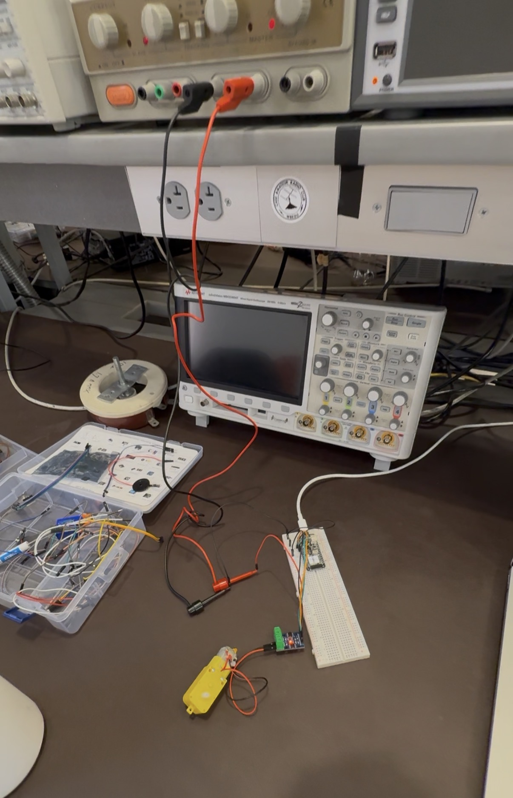
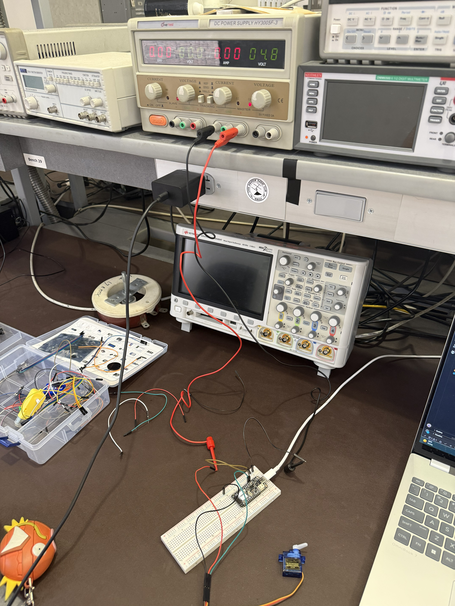

# Lab #4: Actuator Adventures Lab
## Date: September 18th, 2026

**Name:** Zachary Blue

This is my third assignment with the ESP32, and I'll be connecting actuators (specifically a TT motor and a servo motor). I will be uploading via VS Code + PlatformIO using a Windows laptop. 

---

## Repository Contents
- **TT Motor.cpp** - runs the TT motor once: full power in one direction for a set time, then stops. Used for the analogWrite/delay/swap experiments
- **TT Motor Rotate.cpp** - loops the motor through a repeating sequence: clockwise 5s, stop 2s, counterclockwise 2s, with messages displaying that announces each phase
- **Servo Motor.cpp** - moves the servo motor smoothly from 0 degrees to 180 degrees and back, one degree at a time, converting each angle to its pulse width with map(). It's used for the five servo parameter experiment
- **Servo Motor Random.cpp** - moves the servo to a random angle between 0 degrees and 180 degrees every 1.5 seconds instead of linearly moving

## TT Motor Circuit

## Parameter Observations (TT Motor)
- **analogWrite value:** Changed 255 -> 100: I found that the motor does not spin even though it seems like it is trying to. Then, I changed 100 -> 200: I found that the motor spun, this shows that the value controls the turning speed
- **Swapping the analogWrite values:** Moved the power from 1A to 1B: the motor reversed direction. 
- **delay value:** Changed 5000 -> 10000: the motor spun for 10 seconds instead of 5 seconds before stopping

## Servo Circuit

## Parameter Observations (Servo)
- **minPulseWidth:** 500 → 1000: the servo no longer reached its full range on the low end
- **maxPulseWidth:** 2500 → 2000: the same clipping happened on the other end, so with both changes the servo moved a noticeably narrower arc overall
- **setPeriodHertz:** 50 → 30: the motion became visibly jerky. With fewer position updates per second, you can see the servo stepping in small increments instead of gliding
- **Rotation range:** 180 → 90: the servo only moved half of its arc, so each full cycle completed in about half the time
- **delay:** 15 → 50: each one-degree step held longer before the next, making the stepping obvious and the overall motor movement appear slower

## Steps I Took
- Downloaded the fixed servo code and new wiring diagrams from the template repo since the old ones had errors
- Made actuator_adventures.md and opened the Lab 4 project in PlatformIO, set the monitor speed
- Wired the TT motor to the motor driver and breadboard, connected the driver to pins A1 and A0, set the power supply to 3 volts
- Set the pins in TT Motor.cpp, ran it, then tested changing the power value, swapping the pins, and changing the delay
- Wrote TT Motor Rotate.cpp so the motor spins clockwise, stops, spins counterclockwise, stops, and repeats
- Filmed the motor running the sequence
- Rewired the breadboard for the servo, set the power supply to 5 volts, installed the servo library
- Ran Servo Motor.cpp and tested changing the five servo settings one at a time
- Wrote Servo Motor Random.cpp so the servo jumps to random angles
- Filmed the servo moving randomly and took pictures of both circuits

## Reflection
This lab took me about 2.5 hours to complete. I would rate the difficulty as medium. The part I found most challenging was the power supply connection. I was actually a bit rusty, so I had to ask for help on how to get my power supply going. Other than that, it was pretty starightforward, just long. I feel very comfortable with the course content so far. As for feedback, this was honestly a fun lab, even though it was on the longer side.