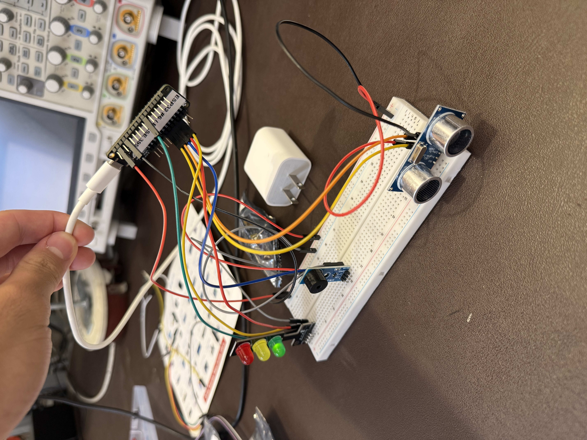

# Lab #5: Integration Exploration
## Date: September 25th, 2026

**Name:** Zachary Blue

This is my final ESP32 assignment where I will be integrating sensors and actuators. Specifically, I will be using an ultrasonic sensor, a passive buzzer, and a traffic light module. This lab will be done using PlatformIO on my Windows laptop. 

---

## Desired Behavior: 
My prototype is a distance-based warning device with the application being related to my semester project of detecting when a baby gets too close to the stairs and alerting the parents of it. The ultrasonic sensor continously measures the distance to the nearest object. When nothing is within 0.5m of the device, the buzzer does nothing and the traffic light shows green. When an object comes within 0.5m of the device, the buzzer starts making a slow beeping noise and the traffic light turns yellow. If an object were to come within 0.2m, the buzzer will begin to beep rapidly and the traffic light would turn red. So, the closer the object, the more urgent the visual and audible warning is. 

## Repository Contents:
- **main.cpp:** contains the full integration: reads the ultrasonic sensor using a median-of-three filter, then activates the traffic light module and the passive buzzer through a three-tier distance threshold system where they are green/silent above 50cm, yellow/slow beeping from 20cm-50cm, and red/fast beeping below 20cm. The code also contains helper functions such as readDistance() and middleOf().

## Circuits and Wiring:

- ESP32 3V pin wired to the breadbaord red rail and ESP32 GND wired to the blue rail. These two act as shared power and ground that every module on the breadboard can use.
- Ultrasonic HC-SR04: VCC wired to red rail, GND wired to blue rail, TRIG wired to GPIO 27 (the pin that the code pulses in order to fire a sound burst), and ECHO wired to GPIO 33 (the pin that the sensor raises while waiting for the echo, which the code times). 
- Traffic light module: GND wired to blue rail, red LED wired to GPIO 32, yellow LED wired to GPIO 14, and green LED wired to A5. Each LED turns on when its pin is driven HIGH
- Passive buzzer: GND wired to the blue rail, VCC wired to the red rail, I/O (signal) wired to GPIO 15. It was driven using tone() because a pasive buzzer needs a frequency signal rather than steady power. 

## Steps I took:
- Chose the ultrasonic sensor, passive buzzer, and traffic light module, inspired by my team's baby-stairs project
- Created the md file and Lab 5 PlatformIO project and set the monitor speed
- Wired shared power/ground rails, then wired and tested each module one at a time: ultrasonic distance readings first, then a traffic light blink test, then a buzzer beep test to make sure the hardware components worked
- Wrote the three-tier threshold logic (50cm and 20cm cutoffs)
- Noticed glitch readings (1211cm timeouts and 0cm misfires) causing false triggers, so I added a range filter and then implemented a median-of-three reading system with readDistance() and middleOf() functions to reject glitches
- Kept the range filter as a backstop for double glitches
- Tested by moving a hand through all three zones, recorded the video, photographed the circuit

## Reflection:
This lab took me about 3 hours. I would rate it medium difficulty. It was long, but each individual piece was manageable since we had practiced sensors and actuators in the previous labs. The most challenging part was dealing with the ultrasonic sensor's glitch readings: it would occasionally return values like 1211cm or 0cm, which caused false triggers. I went beyond the base requirements by implementing a median-of-three filter with a range-check backstop to reject these glitches, which made the system much more reliable. I feel very comfortable with the course content at this point. Overall this was my favorite lab so far since we got to design our own system, and mine honestly doubles as an early prototype for my team's semester project.