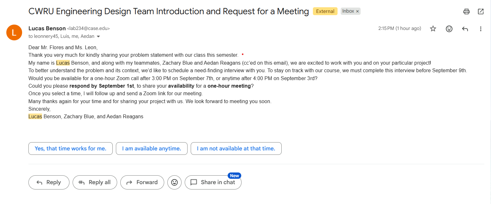

# Week 1 Project Log
**Team:** Zachary Blue, Aedan Reagans, Lucas Benson

## Wednesday, August 26, 2026
- Our team was assigned by our professor, and I want to note that Aedan has not been into class/lab yet, so we haven't seen him at all
- Lucas and I ranked the project choices and we were assigned to the choice regarding the baby getting too close to the stairs

## Friday, August 28, 2026
- I worked individually on Lab 1
- Lucas and I filled out our respective parts of the team contract. I got assigned to Team Leader, and he got assigned to Secretary. We are still waiting for Aedan, as he is currently not on campus yet. He will sign that before tonight though
- Lucas drafted the email to our stakeholders, and I reviewed it thoroughly. 

